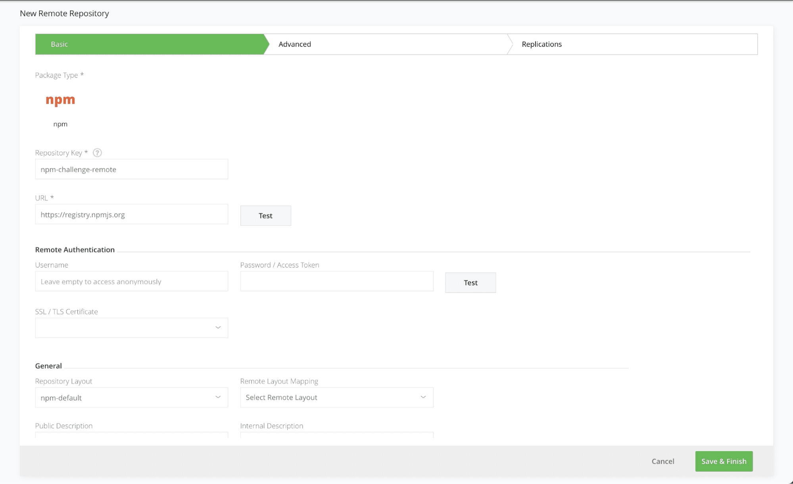

## Add remote npm repository

Used as a caching proxy, to store 3rd party from https://registry.npmjs.org

Click on the Remote tab on the Repositories page and add a new Remote Repository with the Npm package type. Enter the Repository Key “npm-challenge-remote” and keep the rest of the default settings.

