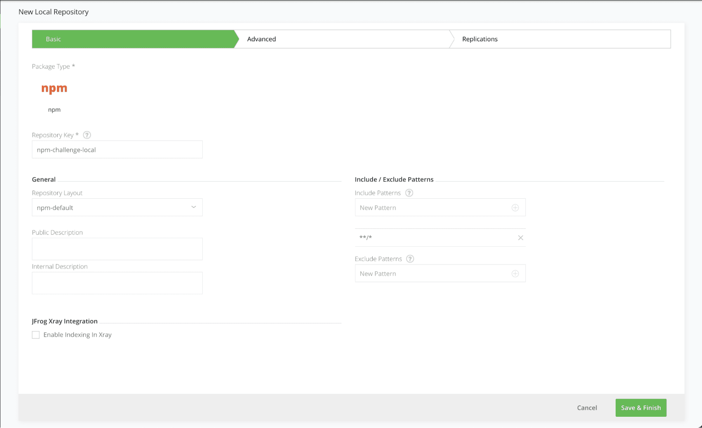
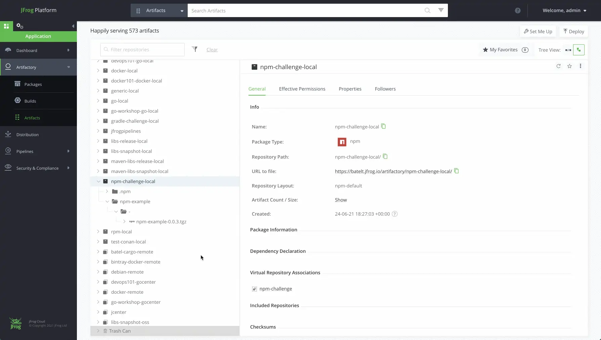

**How to set up a Private, Remote and Virtual npm Registry**

The simplest way to manage and organize your Node dependencies is with an npm repository. You need reliable, secure, consistent and efficient access to your dependencies that are shared across your team, in a central location. Including a place to set up multiple registries, that work transparently with the npm client.

With the JFrog free cloud subscription, including JFrog Artifactory, Xray and Pipelines, you can set up a free local, remote and virtual npm registry in minutes. This blog post will take you through the steps.

**Before you start**
Here’s what you’ll need:

    npm client installed
    JFrog self-hosted subscription or JFrog cloud subscription
    JFrog CLI installed
**Step 1: Login to your environment**

Login using the default username: admin, and password: password for the on-prem installation, or the credentials provided to you by email for the cloud installation.

**Step 2: Add local npm repository**

Used to store your custom npm you will create in a later step. Navigate to the Administration Module. Expand the Repositories menu and click on the Repositories menu item.

Add a new Local Repository with the npm package type. Enter the Repository Key “npm-challenge-local” and keep the rest of the default settings.

**Step 3: Add remote npm repository**

Used as a caching proxy, to store 3rd party from https://registry.npmjs.org

Click on the Remote tab on the Repositories page and add a new Remote Repository with the Npm package type. Enter the Repository Key “npm-challenge-remote” and keep the rest of the default settings.

**Step 4: Add virtual npm repository**

Click on the Virtual tab on the Repositories page and add a new Virtual Repository with the npm package type.

Enter the Repository Key “npm” and add the local and remote npm repository you created in Steps 2 and 3 (move them from Available Repositories to Selected Repositories using the arrow buttons). The order of these repositories in the list will determine the order used to resolve the dependencies required for building your npm package.

Select your local repository that you created in Step 2 as the Default Deployment Repository. The Default Deployment Repository is the repository that the npm dependencies you build will be pushed to. Keep the rest of the default settings.

**Step 5: Fork the JFrog npm example GitHub repo**

This repository contains a simple npm challenge you will use to build your project.

**Step 6: Configure JFrog CLI**

Configure JFrog CLI, a smart client that provides a simple interface that automates access to JFrog products simplifying our automation scripts.

Configure the Artifactory server.
-   $ jfrog rt c

Take the following steps to build the project with npm and resolve the project dependencies from Artifactory.
Move to the root project directory
Configure the project’s repositories.
-   $ jfrog rt npmc

Install the npm package
-   $ jfrog rt npm-install --build-name=my-npm-build --build-number=1

Add environment variables to the build-info.
-   $ jfrog rt bce my-npm-build 1

Pack and publish the npm package to Artifactory, while recording it as artifact in the build-info.
-   $ jfrog rt npm-publish --build-name=my-npm-build --build-number=1

Publish the build info to Artifactory.
-   $ jfrog rt bp my-npm-build 1

**Step 7: View your repository**

Navigate to the Application Module, in the Platform UI, expand the Artifactory menu and click the Artifacts menu item. Here you’ll be able to see the details of your new artifacts.

**Your npm repository**

Once you’re done and configured your Npm repository, you’ll be able to store all your dependencies in your local, remote and virtual repositories. Here’s how it will look:

