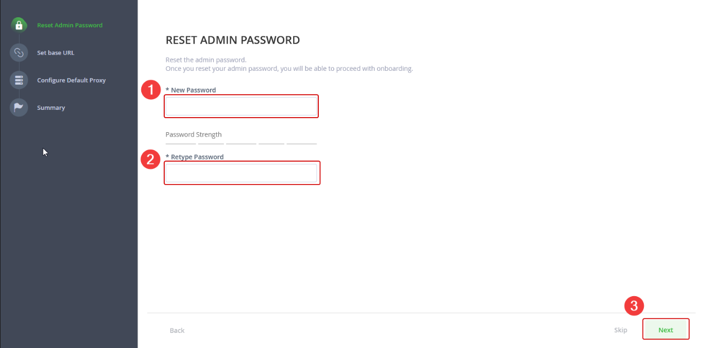

# How to set up a Private, Remote and Virtual npm Registry

The simplest way to manage and organize your Node dependencies is with an [npm repository](https://www.jfrog.com/confluence/display/JFROG/npm+Registry). You need reliable, secure, consistent and efficient access to your dependencies that are shared across your team, in a central location. Including a place to set up multiple registries, that work transparently with the npm client.

With the [JFrog free cloud subscription](https://jfrog.com/start-free/), including JFrog Artifactory, Xray and Pipelines, you can set up a [free local, remote and virtual npm registry](https://www.jfrog.com/confluence/display/JFROG/Repository+Management) in minutes. This blog post will take you through the steps.

## Login to your JFrog Portal :

1. Navigate to the [JFrog Portal](http://artifact535865.eastus.cloudapp.azure.com/ui/login/) Login using the default Username: `admin`, and Password: `password`.

2. On the **Welcome to the jfrog platform** page, click on **Get Started**.
   
   
   
3. On the **Reset Admin Password** page, In the new password and retype password field enter  `Password1234!!` then click on **Next**.
   > Note: It is mandatory to update the password.
 
   
   
4.  On **set base URL** and **Configure Default Proxy** page, select **Skip**,
 
5. On **Summary** page, select **Finish**
    
   
