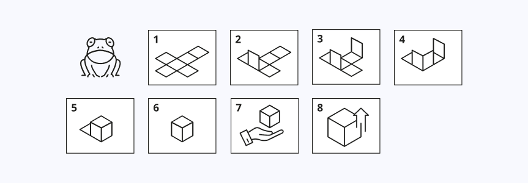

# JFrog Artifactory: How to set up a Private, Remote and Virtual npm Registry

The simplest way to manage and organize your Node dependencies is with an [npm repository](https://www.jfrog.com/confluence/display/JFROG/npm+Registry). You need reliable, secure, consistent and efficient access to your dependencies that are shared across your team, in a central location. Including a place to set up multiple registries, that work transparently with the npm client.

With the  JFrog Artifactory, you can set up a [free local, remote and virtual npm registry](https://www.jfrog.com/confluence/display/JFROG/Repository+Management) in minutes. This lab  will take you through the step to do that.

## Getting started with the Lab environment

Here’s what is provided as part of the lab environment:

1. In the environment provided, an SSH session to the Linux virtual machine and lab guide will get loaded in your browser tab. If the SSH session is still not up yet, wait for a couple of minutes before reaching out to the instructor. 
   
   

   > Note: Within the VM, [JFrog CLI](https://jfrog.com/getcli/) and [npm client](https://docs.npmjs.com/getting-started) is pre-installed.

2. To get the lab environment details, you can select the **Environment Details** tab. Additionally, the credentials will also be sent to your email address provided during registration.

   
   
3. You can also open the Lab Guide on a separate full window by selecting the **Split Window** button on the bottom right corner.

   

4. You can **start(1)** or **stop(2)** the Virtual Machine from the **Resources** tab.

   

5. There is also a **Validation** tab where you will be able to validate and verify if the task as part of the instructions has been completed successfully.
 
   
  
## Task: Log in to JFrog Portal

1. Let us start by logging into the JFrog Portal. Copy the below link and open in a new tab in your browser.

   <inject key="Fqdn" enableCopy="true" />

1. In the page that loads up, enter the following username, password and click on **Log in**. 

   * Username: <inject key="JFrog Portal Username"></inject>

   * Password: <inject key="JFrog Portal Password"></inject>

   

1. Now, you will be redirected to the JFrog Portal. On the Welcome Popup Window that opens up, click on **Get Started** button.

   
  
1. In the REST ADMIN PASSWORD page, update the password as `Password1234!!` in the popup window and click on **Next**
   
   
   
  > Note : It is mandatory to update the password with the above value itself to ensure the validation is possible.

1. Click on **finish** after all the configurations are completed.
   
   

Once you have completed the above steps, you can move on to the next page.
