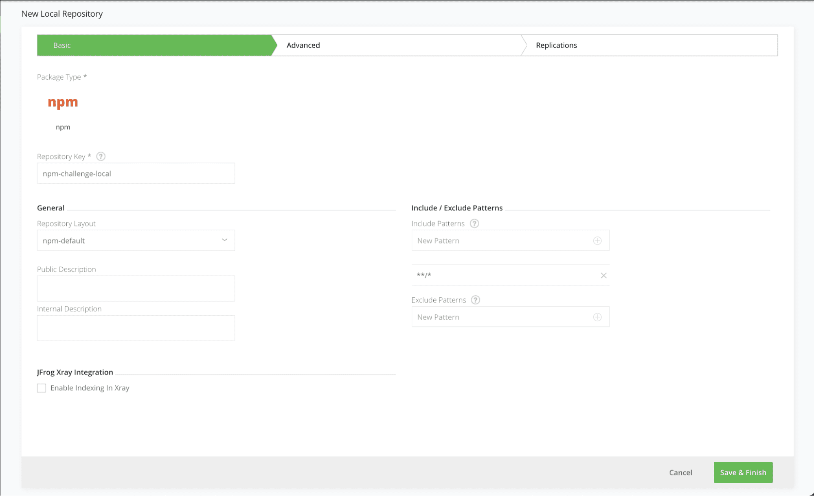

## Task 2: Add local npm repository

You will be creating a repository which will be used to store your custom npm you will create in a later step. 

1. Navigate to the Administration Module within the JFrog Portal. 

1. Expand the Repositories menu,

1. Now, Click on the Repositories menu item.

1. Then, Add a new Local Repository with the npm package type. 

1. Enter the Repository Key “npm-challenge-local” 

    ```
    npm-challenge-local
    ```

1. And keep the rest of the default settings and create the repo.

   
   
Once you have completed the above steps, you can move on to the next page.
