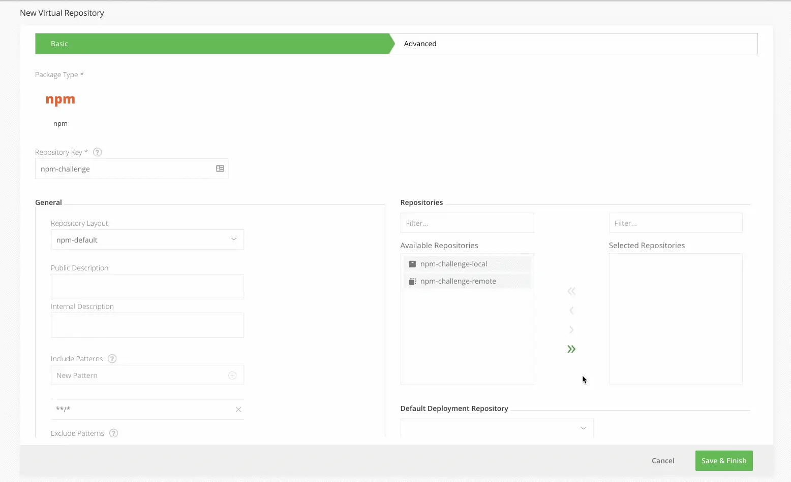

## Add virtual npm repository

Click on the Virtual tab on the Repositories page and add a new Virtual Repository with the npm package type.

Enter the Repository Key “npm” and add the local and remote npm repository you created in Steps 2 and 3 (move them from Available Repositories to Selected Repositories using the arrow buttons). The order of these repositories in the list will determine the order used to resolve the dependencies required for building your npm package.

Select your local repository that you created in Step 2 as the Default Deployment Repository. The Default Deployment Repository is the repository that the npm dependencies you build will be pushed to. Keep the rest of the default settings.

