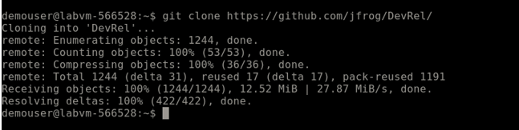

## Task 5: Fork the JFrog npm example GitHub repo

In this task, you will be setting up this [repository](https://github.com/jfrog/DevRel/) which contains a simple npm challenge on the Linux VM provisioned for you to build your project.

1. Go back to the SSH session that has been provided to you within the Lab Environment Page.

1. Execute the following command to clone the repository to the machine

    ```
    git clone https://github.com/jfrog/DevRel/
    ```
    The output for the above command will be similar to below screenshot.
    
    
    
1. Execute the following command to change to the directory of the cloned repository in the VM.

    ```
    cd DevRel/Npm_Challenge/
    ```
    The output for the above command will be similar to below screenshot.
    
    
