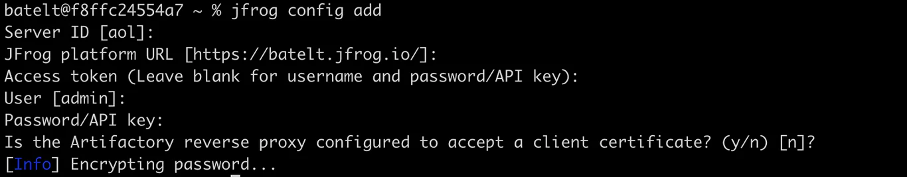
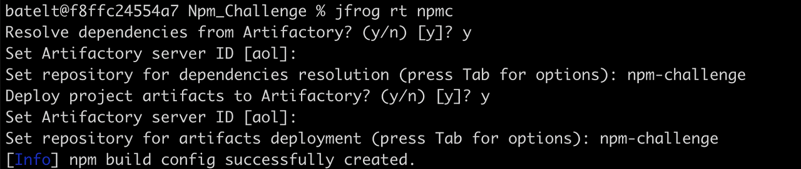

## Configure JFrog CLI

* Configure [JFrog CLI](https://www.jfrog.com/confluence/display/CLI/), a smart client that provides a simple interface that automates access to JFrog products simplifying our automation scripts.

* Configure the [Artifactory server](https://www.jfrog.com/confluence/display/CLI/CLI+for+JFrog+Artifactory#CLIforJFrogArtifactory-Configuration).
  
  `$ jfrog rt c`

* Take the following steps to build the project with [npm](https://www.jfrog.com/confluence/display/CLI/CLI+for+JFrog+Artifactory#CLIforJFrogArtifactory-BuildingNpmPackagesUsingtheNpmClient) and resolve the project dependencies from Artifactory.
   * Move to the root project directory
   * Configure the project’s repositories.
    
     `$ jfrog rt npmc`
     

* Install the npm package
  
  `$ jfrog rt npm-install --build-name=my-npm-build --build-number=1`

* Add environment variables to the build-info.
  
  `$ jfrog rt bce my-npm-build 1`
  
* Pack and publish the npm package to Artifactory, while recording it as artifact in the build-info.
  
   `$ jfrog rt npm-publish --build-name=my-npm-build --build-number=1`

* Publish the build info to Artifactory.
  
   `$ jfrog rt bp my-npm-build 1`
   

