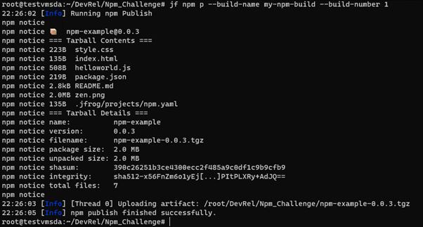

## Task 6: Configure JFrog CLI and build the project with npm

In this task, you will continue to be within the VM that is provided to you and configure the JFrog CLI to build the project with [npm](https://www.jfrog.com/confluence/display/CLI/CLI+for+JFrog+Artifactory#CLIforJFrogArtifactory-BuildingNpmPackagesUsingtheNpmClient) and resolve the project dependencies from Artifactory.


1. Execute the following command to configure the [Artifactory server](https://www.jfrog.com/confluence/display/CLI/CLI+for+JFrog+Artifactory#CLIforJFrogArtifactory-Configuration).
  
    ```
    jf c add
    ```

1. In the prompts, provide the following values:

   * Server ID: Leave blank and hit enter key

   * JFrog platform URL: http://<inject key="Fqdn" enableCopy="true" />

   * JFrog access token: Leave blank and hit enter key

   * JFrog Username: <inject key="JFrog Portal Username"></inject>

   * JFrog Password: 
     ```
     Password1234!!
     ```

   * Finally enter n for "Is the Artifactory reverse proxy..."

    The output for the above command will be similar to below screenshot.
    
    

1. Execute the following command to configure the project’s repositories.
    
    ```
    jf npmc
    ```
    The output for the above command will be similar to below screenshot.
    
    

1. Install the npm package
  
    ```
    jf rt npmi npm --build-name my-npm-build --build-number 1
    ```
    The output for the above command will be similar to below screenshot.
    
    

1. Add environment variables to the build-info.
  
    ```
    jf rt bce my-npm-build 1
    ```
    The output for the above command will be similar to below screenshot.
    
    
  
1. Pack and publish the npm package to Artifactory, while recording it as artifact in the build-info.
  
    ```
    jf rt bag my-npm-build 1
    ```
    The output for the above command will be similar to below screenshot.
    
    

1. Publish the build info to Artifactory.
  
    ```
    jf npm p --build-name my-npm-build --build-number 1
    jf rt bp my-npm-build 1
    ```
    The output for the above command will be similar to below screenshot.
    
    
    
    
   
   
