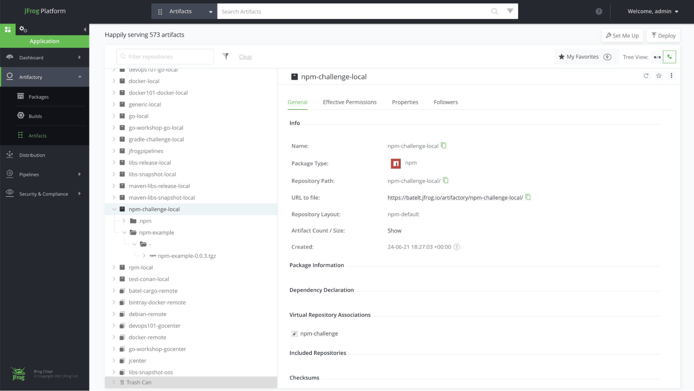
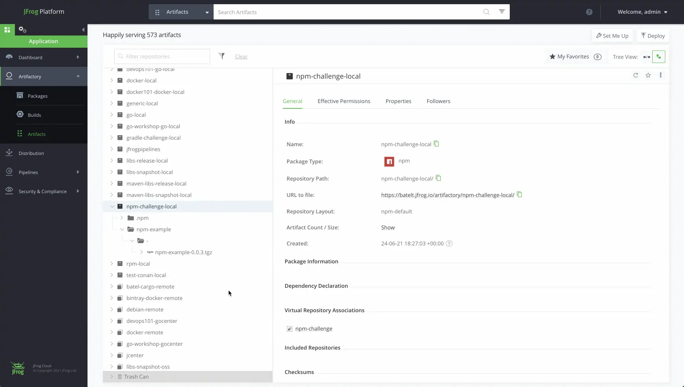

## Task 7: View your repository

Navigate to the Application Module, in the Platform UI, expand the Artifactory menu and click the Artifacts menu item. Here you’ll be able to see the details of your new artifacts.

### Your npm repository

Once you’re done and configured your Npm repository, you’ll be able to store all your dependencies in your local, remote and virtual repositories. Here’s how it will look:

### Validate your task

Once you're done with the above steps, you can go to the validations tab within the Lab Environment Page and click on Validate against the task you see over there to ensure you have done correctly.

Thanks for going through the training. Have a nice day!!
